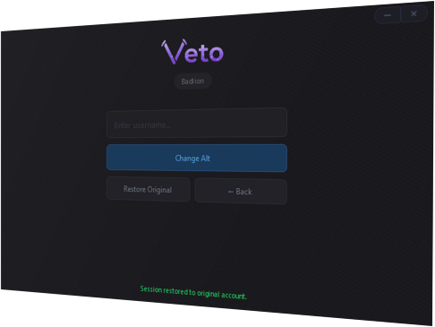

<p align="center">

</p>

<div align="center">

### Alt Manager for Lunar Client, Badlion and Optifine 1.8.9

Minecraft utility that lets you use cracked accounts on premium clients.

# Supported Clients

<br>

<a href="https://www.badlion.net/" target="_blank" style="text-decoration: none; display: inline-block;"></a>&nbsp;&nbsp;&nbsp;&nbsp;&nbsp;&nbsp;&nbsp;&nbsp;<a href="https://www.lunarclient.com/" target="_blank" style="text-decoration: none; display: inline-block;"></a>&nbsp;&nbsp;&nbsp;&nbsp;&nbsp;&nbsp;&nbsp;&nbsp;<a href="https://optifine.net/" target="_blank" style="text-decoration: none; display: inline-block;"></a>&nbsp;&nbsp;&nbsp;&nbsp;&nbsp;&nbsp;&nbsp;&nbsp;<a href="https://www.minecraft.net/" target="_blank" style="text-decoration: none; display: inline-block;"></a>

</div>


# Features

- Auto-detects all running Minecraft 1.8.9 instances
- Change your in-game username in seconds
- Restore your original session at any time
- Recent alts history with Minecraft skin previews
- Minimal, frameless dark UI

# Spoiler

<details>
<summary><b>Click here to see the image</b></summary>

<p align="center">
  
</p>

</details>

# How it works

## 1. Process Detection

VetoAltManager scans all running Java processes using the Windows Toolhelp32 API. For each process it identifies the client type (Lunar, Badlion, OptiFine, Vanilla) by checking the executable path, the window title and the loaded modules.

## 2. DLL Injection

`SessionChanger.dll` is embedded directly inside `VetoAltManager.exe` as a resource and extracted to `%APPDATA%\VetoAlts\` at startup. When you click **Change Alt**, the tool injects the DLL into the target Minecraft process using the classic Windows injection technique:

- `VirtualAllocEx` — allocates memory inside the target process
- `WriteProcessMemory` — writes the DLL path into that memory
- `CreateRemoteThread` + `LoadLibraryA` — makes the target process load the DLL

> **Note:** DLL injection requires the tool to be run as Administrator.

## 3. Session Changing via Named Pipe

Once the DLL is loaded inside Minecraft, VetoAltManager communicates with it through a **Windows named pipe** (`\\.\pipe\VetoAltMgr`). Commands:

| Command | Effect |
|---|---|
| `PING` | Checks if the DLL is ready (`PONG` response) |
| `CHANGE <username>` | Swaps the active session to the given username |
| `RESTORE` | Restores the original session |

The tool polls the pipe every 500ms (up to 30 seconds) after injection until the DLL is ready, then sends the change command automatically.


# Requirements

- Windows 10 / 11
- Minecraft 1.8.9 (must be fully loaded before launching VetoAltManager)
- Administrator privileges (required for DLL injection)


# Usage

1. Launch Minecraft 1.8.9 and wait until you're in the main menu
2. Run `VetoAltManager.exe` as Administrator
3. Select your Minecraft process from the list
4. Type a username and click **Change Alt**
5. To revert, click **Restore Original**


# Building from source

## Requirements
- Qt 6.x (with QtQuick, QtQuick.Controls)
- CMake 3.16+
- MinGW or MSVC (Windows)

## Steps

```bash
cd progetto_cpp
mkdir build && cd build
cmake ..
cmake --build .
```

Or use the provided `build_qt.bat` script on Windows.
